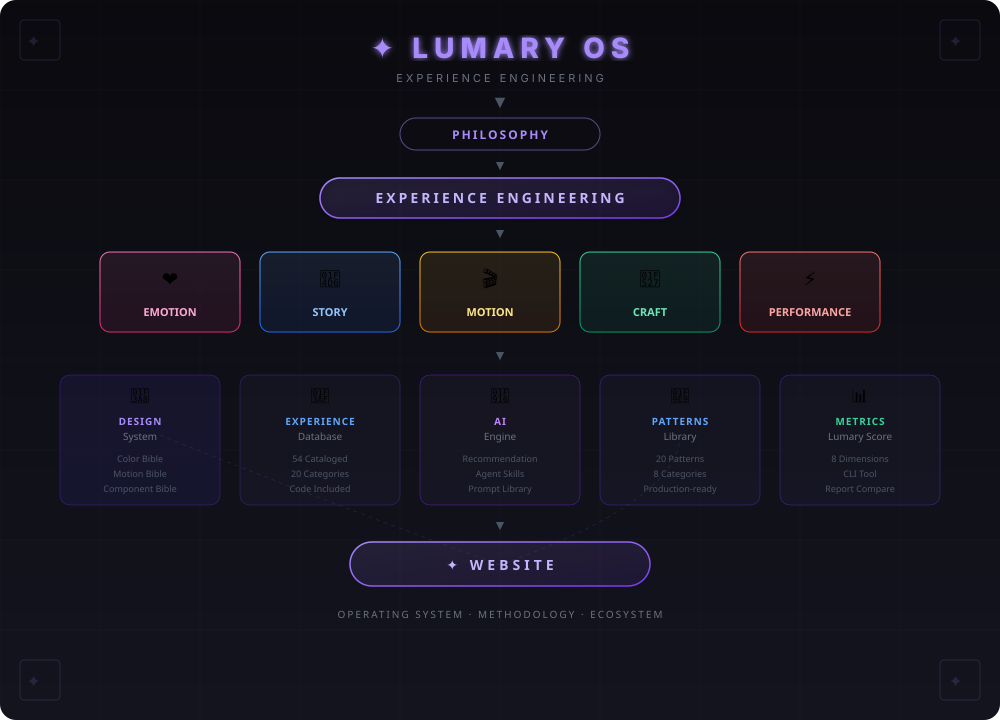

<p align="center">
  <picture>
    <source media="(prefers-color-scheme: dark)" srcset="assets/hero.svg">
    
  </picture>
</p>

<p align="center">
  <b>✦ LUMARY OS</b><br>
  <i>Experience Engineering — The operating system for building digital experiences people remember.</i>
</p>

<p align="center">
  <a href="#-start-here">START HERE</a> ·
  <a href="docs/00-manifesto.md">Manifesto</a> ·
  <a href="#-architecture">Architecture</a> ·
  <a href="#-comparison">Why Lumary</a> ·
  <a href="#-quick-reference">Quick Reference</a> ·
  <a href="ROADMAP.md">v4.0</a>
</p>

---

## 🎬 START HERE

**1. Read the philosophy** → [`docs/00-manifesto.md`](docs/00-manifesto.md)

**2. Browse the architecture** → [`#architecture`](#-architecture)

**3. Pick an experience** → [`experience-db/`](experience-db/)

**4. Score your work** → `python metrics/lumary-score.py --quick`

**5. Get AI recommendations** → `python experience-ai/recommendation-engine.py --interactive`

**6. See it in motion** → Open [`labs/liquid-navigation/index.html`](labs/liquid-navigation/index.html)

---

## 📁 Architecture

```text
lumary-os/
├── 📄 docs/                      # 26 docs (manifesto → security)
├── 🎯 experience-db/             # 54 experiences · 20 categories
├── 🧩 patterns/                  # 20 production-ready patterns
├── 📘 component-bible/           # 5 component systems
├── 🎨 color-bible/               # 9 industry palettes
├── 🏃 motion-bible/              # 10 animation recipes
├── 🧠 psychology-atlas/          # 12 cognitive principles
├── 🏗️ templates/                 # 7 full templates (4.93/5)
├── 📚 case-studies/              # Apple Vision Pro deconstruction
├── 🔬 labs/                      # Liquid Navigation prototype
├── 📊 metrics/                   # Lumary Score CLI
├── 🤖 experience-ai/             # Recommendation engine
├── 🔬 research/                  # Cognitive science evidence
├── 🎓 certification/             # Bronze → Silver → Gold → Master
├── 📝 prompts/                   # 10 prompt templates
├── 📋 playbooks/                 # Acquisition · delivery · maintenance
└── ⚙️ skills/                    # 5 agent skills
```

---

## 🧠 Philosophy

| Pillar | Core Idea |
|--------|-----------|
| ❤️ **Emotion** | Design for emotional outcomes first, aesthetic outcomes second |
| 📖 **Story** | Every page has a beginning, middle, and end |
| 🎬 **Motion** | Every animation guides, orients, or rewards |
| 🔧 **Craft** | Premium is in the spacing, timing, easing, contrast |
| ⚡ **Performance** | 90+ Lighthouse or it's not finished |

> *"The internet has become predictable. We build experiences people remember, not pages people scan."*

---

## 🔬 Experience Engineering

Most disciplines own a slice — UI, UX, Motion, Frontend. None owns the end-to-end emotional outcome. **Experience Engineering** bridges that gap.

└─ Research → Emotion Mapping → Story Architecture → Experience Design → Motion Design → Development → Optimization → Launch → Evolution

---

## ⚖️ Comparison

| Traditional Agency | Lumary OS |
|---|---|
| Designs pages | **Engineers experiences** |
| Uses templates | **Uses experience architecture** |
| Measures conversions | **Measures emotions + conversions** |
| Animations decorate | **Animations communicate** |
| Delivers a website | **Delivers an operating system** |

---

## 🖼️ Preview

<details>
<summary><b>▶ Liquid Navigation — Lab-001</b></summary>
<br>
<picture>
  <source media="(prefers-color-scheme: dark)" srcset="assets/liquid-nav-preview.svg">
  
</picture>
<br>
<sup>Scroll-triggered glassmorphism nav · Magnetic hover links · 60fps · <a href="labs/liquid-navigation/index.html">Open live →</a></sup>
</details>

---

## 📊 Quick Reference

| Action | Command / Path |
|---|---|
| Read the manifesto | `docs/00-manifesto.md` |
| Study the case study | `case-studies/apple-vision-pro.md` |
| Score any project | `python metrics/lumary-score.py --quick` |
| Get AI recommendations | `python experience-ai/recommendation-engine.py --industry saas --emotion trust` |
| Compare reports | `python metrics/lumary-score.py --compare a.json b.json` |
| Run interactive mode | `python experience-ai/recommendation-engine.py --interactive` |
| List all industries | `python experience-ai/recommendation-engine.py --list-industries` |
| View lab prototype | Open `labs/liquid-navigation/index.html` |
| Build a site | `skills/opencode/lumary-pro-max.md` |

---

## 📈 Stats

| Category | Files |
|---|---|
| 📄 Docs | 26 |
| 🎯 Experience DB | 55 |
| 🧩 Pattern Library | 20 |
| 📘 Component Bible | 4 |
| 🏗️ Templates | 7 |
| 📚 Case Studies | 1 |
| 🔬 Labs | 2 |
| 📊 Metrics | 2 |
| 🤖 Experience AI | 2 |
| 🔬 Research | — (scaffolded) |
| 🎓 Certification | — (scaffolded) |
| 📋 Playbooks | 3 |
| 📝 Prompts | 10 |
| ⚙️ Skills | 5 |
| 🎨 Style Guide | 1 |
| 📁 Supporting | 6 |
| **✦ Total** | **~155+ files** |

---

## 📌 Version

**3.0** — Philosophy · Architecture · Metrics · AI · Case Studies · Labs · Research

[Manifesto](docs/00-manifesto.md) · [Roadmap](ROADMAP.md) · [Vocabulary](docs/vocabulary.md) · [Caveats](docs/caveats.md)

Built by [Lumary Studio](https://github.com/lubirge777-star).
